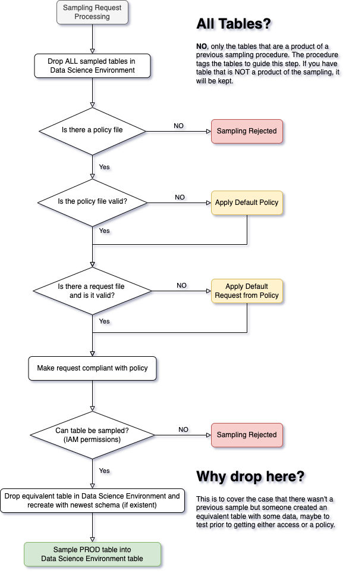
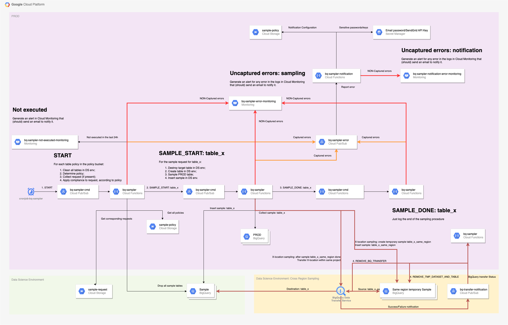

# Design

Below are the different documentation to explain the design behind the code
and, in this sense, guide the validation of it.

## Request processing



[Source](doc/HighLevelRequestFlow.drawio) ([draw.io](https://draw.io))

## Pseudo-algorithm for policy compliance

This is based on the method `Policy.compliant_sample()` in [policy.py](bq_sampler/entity/policy.py)

The table below is assumed to be `bigquery-public-data.new_york_taxi_trips.tlc_fhv_trips_2015`
and for explanation purposes let us assume that the table has `row_count = 10,000`. 

Given the policy and request files' schema below:

Policy:

```json
{
  "__doc__": "Redefines each attribute in the general policy",
  "__table_source__": "bigquery-public-data.new_york_taxi_trips.tlc_fhv_trips_2015",
  "limit": {
    "count": 1234,
    "percentage": 35.1
  },
  "default_sample": {
    "size": {
      "count": 9,
      "percentage": 6.5
    },
    "spec": {
      "type": "sorted",
      "properties": {
        "by": "pickup_datetime",
        "direction": "ASC"
      }
    }
  }
}
```

Request:

```json
{
  "__doc__": "Full sample request against a full policy specification",
  "__table_source__": "bigquery-public-data.new_york_taxi_trips.tlc_green_trips_2015",
  "size": {
    "count": 3000,
    "percentage": 11.7
  },
  "spec": {
    "type": "sorted",
    "properties": {
      "by": "dropoff_datetime",
      "direction": "DESC"
    }
  }
}
```

**NOTE**: The policy entry `default_sample` has the same schema as the whole request file schema.

### Computing policy allowed row amount

To compute that we need to convert the limit to absolute count and take the minimum of the two values:

1. Convert `percentage` to count:
   1. `limit.percentage_count = floor(percentage * row_count / 100)`
   2. `limit.percentage_count = floor(35.1 * 10,000 / 100)`
   3. `limit.percentage_count = floor(35,100)`
   4. `limit.percentage_count = 35,100`
2. The limit is the minimum between the `count` and `percentage` (converted to count);
   1. `limit.actual_count = min(count, percentage_count)`
   2. `limit.actual_count = min(1,234, 35,100)`
   3. `limit.actual_count = 1,234`

This means that, regardless of the request, the maximum amount of rows is capped at `1,234` rows.

### Compute the request's row amount

To get what the request _wants_ as a row count we need to take maximum 
between the count and the percentage (converted to count):

1. Convert `percentage` to count:
   1. `request.percentage_count = ceil(percentage * row_count / 100)`
   2. `request.percentage_count = ceil(11.7 * 10,000 / 100)`
   3. `request.percentage_count = ceil(11,700)`
   4. `request.percentage_count = 11,700`
2. The limit is the maximum between the `count` and `percentage` (converted to count);
   1. `request.actual_count = max(count, percentage_count)`
   2. `request.actual_count = max(3,000, 11,700)`
   3. `request.actual_count = 11,700`

### Compute the compliant request

The request that will be processed is the minimum between the `limit.actual_count` and `request.actual_count`:

1. `actual_request.count = min(limit.actual_count, request.actual_count)`
2. `actual_request.count = min(1,234, 11,700)`
3. `actual_request.count = 1,234`

### Compute sampling specifications: `spec`

In this case, since the request specify the `spec` entry, 
it will completely overwrite the one in `default_policy` provided by the policy.
This means that the final `spec` is:

```json
"type": "sorted",
"properties": {
  "by": "dropoff_datetime",
  "direction": "DESC"
}
```

**NOTE**: In the policy it specifies the column `pickup_datetime` in `ASC` order.

### Actual request to be processed

Given the above, the equivalent full compliant request to be processed is:

```json
{
  "size": {
    "count": 1234
  },
  "spec": {
    "type": "sorted",
    "properties": {
      "by": "dropoff_datetime",
      "direction": "DESC"
    }
  }
}
```

## Infrastructure



[Source](doc/DataScienceEnvDesign.drawio) ([draw.io](https://draw.io))